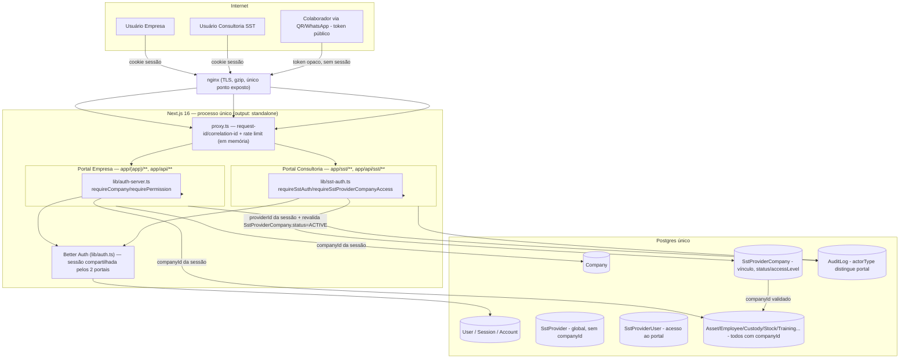
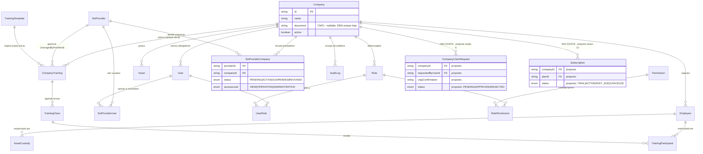

# Dossiê de Continuidade Arquitetural — MVP SST (Patrium / Gestão de Ativos)

Auditoria técnica, arquitetural, funcional e comercial completa, produzida para handoff a outro arquiteto. Baseada em inspeção direta do código (schema, migrations, 71 rotas de API, páginas dos dois portais, docs internas, scripts de deploy) — não em suposição. Onde a evidência não foi suficiente, isso está marcado explicitamente.

Data da auditoria: 2026-07-10. Estado do repositório: branch `main`, HEAD em `48a5a71`.

---

## A. Resumo executivo

**O que este projeto realmente é**: não é um "MVP de SST" no sentido de um produto voltado primariamente a SST. É uma plataforma madura de **gestão de ativos/patrimônio** (ativos, unidades, custódia, estoque, colaboradores, relatórios, alertas, importação em massa) — nome interno "Patrium" — sobre a qual um **módulo de Treinamentos SST** foi construído em sprints incrementais bem documentadas, e que agora está ganhando um **Portal Consultoria SST** (`/sst`) como segundo portal, com login e RBAC próprios. O Portal Empresa é o produto principal e está com qualidade de produção. O módulo SST/Consultoria é a parte nova e é onde as decisões de continuidade importam.

**Nível de maturidade**: alto para um projeto de ~9 dias de migrations (2026-07-02 a 2026-07-10). Isolamento multi-tenant é aplicado de forma consistente e centralizada (helpers `requireCompany`/`requirePermission`/`requireSstAuth`/`requireSstProviderCompanyAccess`), validação de entrada é feita via Zod em toda rota de escrita, há trilha de auditoria (`AuditLog`) com boa disciplina de não vazar dado sensível, observabilidade básica (logs estruturados, request id, health check, métricas Prometheus) e um pipeline de deploy Docker bem documentado com backup/restore testável. Isso é incomum para um projeto desse estágio e reduz bastante o risco de reescrita.

**O que falta e é bloqueador para a estratégia comercial descrita pelo usuário**: o fluxo de **pré-cadastro de empresa por consultoria** (seção G) **não existe em nenhuma forma** — nem schema, nem rota, nem UI. Hoje é o inverso do que a estratégia comercial descreve: é a **empresa** que cria e autoriza um prestador (`POST /api/sst-providers`), nunca o prestador que cria uma empresa. Uma consultoria só enxerga uma empresa que já existe, já tem login próprio, e que explicitamente a autorizou. Isso não é um bug — é uma lacuna de escopo, documentada como "fora de escopo" em `docs/sst-providers.md`/`docs/portal-consultoria.md`. Construir o pré-cadastro exige decisão de modelagem nova (seção G) antes de qualquer código.

**Segurança/isolamento de tenant**: a auditoria dedicada (71 rotas de API) não encontrou nenhum IDOR, vazamento entre empresas ou entre consultorias, nem mass assignment. O padrão é uniforme: toda rota deriva `companyId`/`providerId` da sessão, nunca do cliente, e toda query de negócio filtra por esse valor. Isso foi verificado por um agente dedicado e parcialmente re-verificado por mim (rotas de Asset/Employee). Não é uma garantia absoluta (ver ressalvas na seção H), mas é uma base sólida — não há indício de que o sistema precise de reescrita por causa de segurança.

**LGPD**: nenhum mecanismo de criptografia em repouso, anonimização, exportação de dados pessoais ou "direito ao esquecimento" existe. CPF, assinaturas (imagem/dado biométrico simplificado), fotos de custódia e IP/user-agent de quem assina ficam em texto puro no Postgres, sem período de retenção definido. Isso **não bloqueia o MVP tecnicamente**, mas é um risco jurídico real assim que houver o primeiro cliente pagante com dados de terceiros (colaboradores) — precisa de validação jurídica formal antes da comercialização (não é objeto desta auditoria decidir).

**Testes automatizados e CI/CD**: nenhum teste automatizado existe no projeto (zero arquivos `*.test.ts`/`*.spec.ts`/`__tests__` fora de `node_modules`) e não há pipeline de CI (`.github/workflows` inexistente). O único gate antes de deploy é `next build` (que roda typecheck) + lint manual. Isso é o maior risco de regressão silenciosa à medida que o módulo SST cresce sobre o módulo de ativos já em produção.

**Recomendação**: **continuar o desenvolvimento incremental sobre a base atual — não reescrever.** A arquitetura de multi-tenant (Company como tenant raiz, SstProvider como tenant global do outro portal, vínculo via tabela de junção com status) é sólida e já foi pensada para os próximos portais (Colaborador, Super Admin) sem exigir migração de dado. O trabalho que falta é aditivo: modelar o pré-cadastro/reivindicação (decisão de arquitetura pendente, seção J), fechar lacunas de LGPD, adicionar testes de isolamento de tenant, e decidir a fronteira de billing/entitlements antes do primeiro cliente pagante.

---

## B. Inventário do que existe

| Módulo | Funcionalidade | Status | Evidência | Qualidade | Pendências |
|---|---|---|---|---|---|
| Portal Empresa — Ativos | CRUD, QR code, certificações CA, busca/filtro/paginação server-side | Concluído | `app/(app)/assets/**`, `app/api/assets/**`, `lib/assets.ts` | Alta | — |
| Portal Empresa — Estoque | Saldo (consumível+individual unificado), movimentações, entrada | Concluído | `app/(app)/stock/**`, `lib/stock.ts` | Alta | `/reports?tab=stock` ~1,5s em escala (limitação conhecida, documentada) |
| Portal Empresa — Custódias | Entrega/devolução, termo HTML, assinatura (presencial e remota via WhatsApp), fotos, QR | Concluído | `app/(app)/custodies/**`, `app/api/custodies/**` | Alta | Geração de PDF não implementada (só HTML) |
| Portal Empresa — Colaboradores | CRUD, soft delete (status INACTIVE), departamento/cargo auto-criados | Concluído | `app/(app)/employees/**` | Alta | — |
| Portal Empresa — Treinamentos (catálogo/turmas/participantes) | CRUD completo, máquina de estados de turma, controle de concorrência, vencimento calculado | Concluído | `docs/trainings-domain.md`, `docs/training-architecture.md` | Alta | Sem certificado/anexo, sem alerta de vencimento persistido, sem relatório dedicado |
| Portal Empresa — Prestadores SST (autorização) | Empresa cria/autoriza/suspende/revoga um `SstProvider` | Concluído | `app/api/sst-providers/**`, `docs/sst-providers.md` | Alta | Sem dedup entre empresas (cada empresa recria o mesmo prestador do zero) |
| Portal Empresa — Relatórios | 4 relatórios (ativos, estoque, custódias, CA a vencer), export CSV client-side | Concluído | `docs/reports.md` | Alta | Sem export PDF; sem relatório de treinamento |
| Portal Empresa — Alertas | CA vencido/vencendo, custódia atrasada, estoque baixo — calculado sob demanda | Concluído | `docs/alerts.md` | Alta | Sem alerta de treinamento vencendo (dado pronto, cálculo não implementado); sem e-mail/notificação |
| Portal Empresa — Importação em massa | Excel (colaboradores/ativos/estoque), preview + confirmação, dedup por CPF/SKU | Concluído | `docs/imports.md` | Alta | Não importa custódias/assinaturas/documentos antigos (fora de escopo declarado) |
| Portal Empresa — Configurações/Usuários | Perfil da empresa, WhatsApp (Evolution API), gestão de usuários/papéis do sistema | Funcional com ressalvas | `app/(app)/configuracoes/**` | Média-Alta | Sem UI para criar papéis customizados (schema suporta, tela não existe) |
| Autenticação (Better Auth) | Login, logout, recuperação de senha, sessão, revogação em reset | Concluído | `lib/auth.ts`, `docs/auth-rbac.md` | Alta | Sem MFA, sem verificação de e-mail obrigatória (`emailVerified` existe mas não é enforced) |
| Cadastro público (Portal Empresa) | Sempre cria uma `Company` nova; primeiro usuário vira ADMIN | Concluído | `app/api/register/route.ts` | Alta | Sem verificação de CNPJ, sem dedup de empresa por CNPJ |
| Portal Consultoria SST — Login | Login próprio via `SstProviderUser` | Concluído | `app/sst/login/**` | Alta | — |
| Portal Consultoria SST — Dashboard/Empresas | Lista de empresas vinculadas com métricas de conformidade calculadas sob demanda | Concluído | `app/sst/(portal)/companies/**`, `lib/sst-dashboard.ts` | Alta | `getCompanyTrainingMetrics` não escala além de dezenas de empresas por consultoria (1 query por empresa) |
| Portal Consultoria SST — Treinamentos/Turmas/Participantes | CRUD completo, restrito ao que o prestador gerencia (`assertProviderManagesCompanyTraining`) | Concluído | `app/sst/(portal)/companies/[companyId]/**`, `app/api/sst/**` | Alta | Sem seletor de consultoria (usa sempre o vínculo mais antigo se o usuário tiver mais de um) |
| Portal Consultoria SST — Colaboradores | Somente leitura (por design — consultoria nunca cria/edita `Employee`) | Concluído (por escopo) | `lib/sst-employees.ts` | Alta | — |
| Portal Consultoria SST — Gestão do próprio prestador (convidar colega, trocar papel) | **Não implementado** | Não encontrado | `requireSstRole("OWNER")` existe mas nenhuma rota o usa | — | Sem essa rota, um OWNER de consultoria não consegue adicionar um TECHNICIAN pela UI — só via seed/banco |
| Pré-cadastro de empresa por consultoria / reivindicação | **Não implementado, não modelado** | Não encontrado | grep por "reivindic/claim/preCadastr" = 0 resultados | — | Decisão de arquitetura pendente — ver seção G |
| Portal Colaborador | Planejado, sem código | Planejado | `docs/training-architecture.md` seção 9 confirma: "nenhuma forma de um Employee se autenticar" | — | Modelagem já prevê índices prontos (`TrainingParticipant.employeeId`), mas zero autenticação de colaborador |
| Portal Super Admin | Planejado, sem código | Planejado | Não encontrado nenhum artefato | — | — |
| Billing/Assinatura/Plano | **Não implementado** | Não encontrado | Nenhum model `Subscription`/`Plan`/`Invoice` no schema | — | Ver seção 13 |
| Testes automatizados | **Inexistentes** | Não encontrado | 0 arquivos `*.test.ts`/`*.spec.ts` fora de `node_modules` | — | Maior risco de regressão do projeto |
| CI/CD | **Inexistente** | Não encontrado | Sem `.github/workflows` ou equivalente | — | Deploy manual via Docker Compose |
| Deploy/infra (Docker+nginx+backup) | Completo e documentado | Concluído | `docs/deployment.md`, `docs/deploy-checklist.md` | Alta | Instância única (rate-limit e cache em memória — não escala horizontalmente sem mudança) |
| Auditoria (`AuditLog`) | Cobre ações administrativas e de treinamento; distingue ator do Portal Empresa vs Consultoria | Concluído | `lib/audit.ts`, migration `add_audit_actor_type_and_provider` | Alta | Sem UI para consultar o log (dado existe, tela não) |
| LGPD (criptografia, anonimização, exportação, retenção) | **Inexistente** | Não encontrado | Ver seção 10 | — | Requer decisão de produto + validação jurídica |

---

## C. Mapa da arquitetura atual

### Descrição

Aplicação **Next.js 16 (App Router) monolítica**, um único processo Node, Postgres único, Prisma 7 como ORM. Dois portais coexistem no mesmo código-base e no mesmo processo:

- **Portal Empresa** (`app/(app)/**`, `app/api/**` exceto `sst*`): tenant = `Company`, resolvido a partir de `User.companyId` via sessão Better Auth.
- **Portal Consultoria SST** (`app/sst/**`, `app/api/sst/**`, `app/api/sst-providers/**`): tenant = `SstProvider`, resolvido a partir de `SstProviderUser` (não de `User.companyId`).

Os dois portais compartilham a mesma tabela `User`/sessão — um usuário pode ter login de empresa e de consultoria ao mesmo tempo, sem misturar dados, porque cada portal resolve o tenant a partir de uma tabela diferente e nenhum código do Portal Consultoria lê `User.companyId`.

Não há microsserviços, não há fila (BullMQ/Redis), não há cache distribuído — tudo roda em memória de um único processo Node atrás de nginx. Isso é uma decisão deliberada e documentada (`docs/deployment.md`: "rate limiting e cache são em memória do processo, por design... não escale horizontalmente sem migrar isso para um storage compartilhado primeiro").

### Diagrama (Mermaid)

### Dependências, fronteiras, problemas

- **Fronteira Portal Empresa ↔ Portal Consultoria**: bem estabelecida no código (dois módulos de auth separados, dois conjuntos de rotas, dois boundaries de erro — `app/forbidden.tsx` vs `app/sst/forbidden.tsx`). O único acoplamento é que o Portal Consultoria **reaproveita os services de negócio** do Portal Empresa (`createCompanyTraining`, `addParticipants`, etc. de `lib/trainings.ts`/`lib/training-classes.ts`) — decisão deliberada e documentada (evita duplicar regra de negócio), mas significa que qualquer mudança nesses services precisa considerar os dois portais chamando a mesma função com atores diferentes (`ActorInput` com `actorType`).
- **Problema real**: não existe nenhuma camada de "service"/"repository" formal separada das rotas — a lógica de negócio vive em `lib/*.ts` (ex.: `lib/assets.ts`, `lib/trainings.ts`) e é chamada diretamente pelas rotas de API e por Server Components. Isso funciona bem no tamanho atual, mas à medida que o Portal Colaborador e o Super Admin forem adicionados, esse padrão (função solta em `lib/`, sem interface/contrato explícito) vai exigir disciplina manual para não vazar `companyId` implícito entre chamadas — não há enforcement estrutural (ex.: tipo que obrigue passar tenant).
- **Duplicação**: mínima. O padrão "mesmo service, ator diferente" evita duplicação de regra de negócio entre os portais. A única duplicação notável é de UI (tabelas do Portal Consultoria usam HTML puro em vez de TanStack Table, deliberado para menos código nesta sprint).
- **Regra de negócio na interface**: não encontrada como padrão sistemático — as poucas validações client-side (ex.: `lib/validations/*.ts` usando Zod) são espelhadas no servidor (mesma lib de validação importada nos dois lados), então não há uma checagem "só no client".
- **Escalabilidade**: o maior risco arquitetural real é o cache/rate-limit em memória de processo único — bloqueia escalar horizontalmente sem trabalho extra (mover para Redis ou equivalente). Para 10-100 empresas isso não importa; para 1.000+ (seção 17) precisa ser resolvido.
- **Decisões caras/irreversíveis já tomadas**: (1) `SstProvider` sem `companyId`, isolamento via tabela de junção — correta e já pensada para o cenário de consultoria-atende-várias-empresas; não vai exigir migração. (2) Fotos/assinaturas/logo armazenados como `dataUrl` base64 direto nas colunas do Postgres, sem storage externo (S3 etc.) — funciona hoje (backup cobre 100% do estado), mas é uma decisão que fica cada vez mais cara de reverter à medida que o volume de fotos cresce (linhas de banco maiores, backups maiores, sem CDN). Vale reavaliar antes de escalar para milhares de custódias com foto.

---

## D. Arquitetura-alvo recomendada

A base atual **não precisa de reescrita** para suportar os próximos portais — precisa de adições estruturadas. Recomendação:

1. **Módulos**: manter a separação atual por portal (Empresa/Consultoria/futuramente Colaborador/SuperAdmin), cada um com seu próprio módulo de auth (`lib/auth-server.ts`, `lib/sst-auth.ts`, futuro `lib/employee-auth.ts`, `lib/admin-auth.ts`) — nunca misturar a resolução de tenant entre eles, exatamente como já é feito hoje. Esse padrão já é o "arquitetura-alvo" para autenticação/autorização; só precisa ser replicado.
2. **Entidades novas necessárias antes do próximo portal**:
   - Para Portal Colaborador: uma forma de autenticação do `Employee` (hoje `Employee` não tem credenciais — precisaria de `Employee.userId` opcional apontando para `User`, ou uma tabela própria de credencial, decisão a tomar).
   - Para pré-cadastro/reivindicação (seção G): novo campo de estado em `Company` (`registrationStatus`) + tabela de solicitação de reivindicação — ver seção G para as 3 alternativas comparadas.
   - Para billing: entidades novas totalmente desacopladas de RBAC — ver seção 13.
3. **Autenticação**: manter Better Auth como base única de identidade (`User`) para todos os portais — não introduzir um segundo provedor de auth. Continuar resolvendo tenant fora do Better Auth (via tabelas próprias), como já é feito.
4. **Autorização**: manter o padrão de dois eixos independentes já usado no Portal Consultoria (papel do usuário × nível de acesso do vínculo) — é o modelo certo para o Portal Colaborador também (papel = nenhum, provavelmente; nível de acesso = escopo por `employeeId` próprio).
5. **Multitenancy**: manter `companyId`/`providerId` sempre derivado do servidor — nunca introduzir uma exceção "por conveniência" a essa regra, mesmo em rotas internas/admin futuras.
6. **Billing**: entidade `Subscription`/`Plan`/`Entitlement` desacoplada de `Role`/`Permission` — ver seção 13, não modelar agora, mas não deixar para depois de já haver muitos clientes (decisão que fica mais cara com o tempo).
7. **Auditoria**: já pronta para reuso — `AuditLog.actorType` só precisa ganhar um terceiro valor (`EMPLOYEE_USER`, `SUPER_ADMIN_USER`) quando os próximos portais existirem.
8. **Integrações**: manter o padrão atual (segredo de servidor único para Evolution API, nunca por usuário) para qualquer integração nova.

---

## E. Modelo de domínio (entidades recomendadas, sobre o que já existe)

O schema atual já cobre a maior parte disto — a adição recomendada é a família de entidades de pré-cadastro/reivindicação (tracejado) e billing (tracejado), nenhuma delas implementada hoje.

Inventário resumido das entidades centrais (detalhe completo nas seções seguintes e nos docs internos `docs/domain-model.md`, `docs/trainings-domain.md`):

| Entidade | Finalidade | Tenant | Unicidade-chave | Soft delete? | Observação |
|---|---|---|---|---|---|
| `Company` | Tenant raiz do Portal Empresa | — (é o tenant) | Nenhuma em `document` (CNPJ) | `active` boolean, sem rota que o altere | **Sem rota de exclusão/encerramento** — não encontrada |
| `User` | Identidade compartilhada pelos 2 portais | pertence a 1 `Company` via `companyId` (irrelevante para Portal Consultoria) | `email` único global | Hard delete permitido (com cascade) | Ver seção 8 |
| `SstProvider` | Consultoria/prestador — catálogo global | nenhum (é global por design) | Nenhuma | `active` boolean | Sem dedup entre empresas que cadastram a "mesma" consultoria |
| `SstProviderCompany` | Vínculo prestador↔empresa — **é aqui que mora o isolamento real** | implícito nos 2 lados | `[providerId, companyId]` único | Não (usa `status` REVOKED como terminal) | `VIEW` nunca gerencia treinamento |
| `SstProviderUser` | Dá acesso ao Portal Consultoria | prestador | `[providerId, userId]` único | `active` boolean | Sem UI de gestão (só seed) |
| `Employee` | Colaborador da empresa | `companyId` | `[companyId, document]` (CPF) único | `status` enum | CPF obrigatório e único por empresa |
| `AssetCustody` | Responsabilidade de colaborador sobre ativo | `companyId` | — | Nunca (imutável, histórico) | Contém dado de assinatura/CPF do assinante indiretamente via `CustodySignature` |
| `AuditLog` | Trilha de auditoria | `companyId` | — | Nunca (imutável) | `actorType` distingue Portal Empresa vs Consultoria |

---

## F. Matriz de permissões

### Portal Empresa (RBAC por `Role`/`Permission`, parametrizável por empresa)

Catálogo real em `lib/permissions.ts`. 6 papéis padrão via seed (`isSystem: true`), mas o schema permite papéis customizados por empresa (sem UI ainda).

| Recurso | ADMIN | GESTOR | RH | ALMOXARIFADO | TECNICO_SST | CONSULTA |
|---|---|---|---|---|---|---|
| Ativos (view/manage) | ✅/✅ | ✅/— | ✅/— | ✅/✅ | ✅/✅ | ✅/— |
| Custódia (view/manage) | ✅/✅ | ✅/— | ✅/— | ✅/✅ | ✅/✅ | ✅/— |
| Estoque (view/manage) | ✅/✅ | ✅/— | — | ✅/✅ | ✅/— | ✅/— |
| Colaboradores (view/manage) | ✅/✅ | ✅/— | ✅/✅ | ✅/— | ✅/— | ✅/— |
| Relatórios (view) | ✅ | ✅ | ✅ | ✅ | ✅ | ✅ |
| Alertas (view) | ✅ | ✅ | ✅ | ✅ | ✅ | ✅ |
| Importação (view/manage) | ✅/✅ | ✅/— | ✅/✅ | ✅/✅ | ✅/✅ | —/— |
| Empresa (manage — perfil/logo) | ✅ | — | — | — | — | — |
| Treinamentos (view/manage) | ✅/✅ | ✅/— | ✅/✅ | ✅/— | ✅/✅ | ✅/— |
| Prestadores SST (view/manage) | ✅/✅ | ✅/— | ✅/— | —/— | ✅/✅ | —/— |
| Usuários/Papéis (manage) | ✅ | — | — | — | — | — |
| Faturamento | **Não modelado** | — | — | — | — | — |
| Dados médicos/sensíveis (CPF em custódia/assinatura) | Implícito — mesma permissão de `custody:view/manage`, **sem granularidade própria** | — | — | — | — | — |

Nota: não existem papéis "Financeiro"/"Auditor" no sistema hoje — o mais próximo de "auditor" é `CONSULTA` (view-only de tudo), mas ele **não tem acesso à trilha `AuditLog`** (não há UI/rota que exponha `AuditLog` para nenhum papel — dado gravado, nunca lido pela aplicação).

### Portal Consultoria SST (2 eixos: papel × nível de acesso do vínculo)

| | VIEW (vínculo) | OPERATION (vínculo) | ADMINISTRATION (vínculo) |
|---|---|---|---|
| **VIEWER** (papel) | leitura | leitura | leitura |
| **TECHNICIAN** (papel) | leitura | leitura + escrita operacional (turma/participante) | leitura + escrita operacional |
| **OWNER** (papel) | leitura | leitura + escrita operacional | leitura + escrita operacional **+ administração** (criar/editar/desativar `CompanyTraining`) |

- **Visualizar dados médicos/sensíveis**: não há distinção — qualquer vínculo `ACTIVE` (mesmo `VIEW`) já enxerga o resumo de treinamento por colaborador (`lib/sst-employees.ts`), que não inclui CPF nem dado de saúde propriamente dito (o sistema hoje não tem exame/atestado — só treinamento). Se dado médico for adicionado no futuro, essa matriz não tem um terceiro nível de "acesso a dado sensível" — precisa ser desenhado.
- **Aprovar/assinar**: não existe conceito de aprovação/assinatura formal no Portal Consultoria (assinatura hoje é só no Portal Empresa, em custódia).
- **Faturamento**: não modelado em nenhum dos dois portais.
- **Gerenciar relacionamentos** (autorizar/suspender/revogar prestador): **exclusivo do Portal Empresa** (`sst_provider:manage`) — a consultoria nunca pode se auto-autorizar ou se re-vincular a uma empresa; correto e intencional.

**Avaliação dos papéis atuais (`OWNER`/`TECHNICIAN`/`VIEWER`) para o MVP e evolução comercial**: suficientes para o escopo funcional atual (operar treinamento), **insuficientes para operação comercial real de uma consultoria com equipe**, porque não há nenhuma rota que permita a um `OWNER` gerenciar os próprios `SstProviderUser` (convidar colega, trocar papel, desativar). Isso é um gap de produto, não de modelagem — o schema já suporta (`SstProviderUserRole` existe, `requireSstRole("OWNER")` existe), só falta a rota/UI.

---

## G. Análise do pré-cadastro por consultoria

### Estado atual: não implementado, em nenhuma camada

Confirmado por leitura de código e por busca textual (`reivindic|claim|preCadastr|companyClaim` = 0 ocorrências fora desta auditoria). O fluxo real hoje é o oposto do descrito na estratégia comercial do usuário:

1. A **empresa** se cadastra sozinha (`POST /api/register`, sempre cria uma `Company` nova).
2. A **empresa**, já logada, cria o registro de um prestador (`POST /api/sst-providers`) e um vínculo `PENDING`.
3. A **empresa** aprova o vínculo (`PATCH /api/sst-providers/[id]` → `ACTIVE`).
4. Só então a consultoria (se tiver um `SstProviderUser` — hoje só via seed) consegue ver essa empresa em `/sst`.

Não existe: `Company.registrationStatus`, tabela de solicitação de reivindicação, validação de CNPJ, nem qualquer rota em que um `SstProviderUser` crie uma `Company`.

### Três alternativas de modelagem

**Alternativa 1 — Campo de estado direto em `Company`** (`registrationStatus: DRAFT | CLAIMED | ACTIVE`, mais `createdByProviderId String?` opcional).
- Vantagens: simples, poucas migrations, reaproveita 100% da tabela `Company` já usada em todo o sistema.
- Desvantagens: mistura responsabilidade — `Company` passa a carregar estado de "quem a criou" e "se foi confirmada", o que é uma preocupação de onboarding/comercial, não de tenant. Migração de dado ambígua no dia em que a empresa reivindica (o que muda exatamente? o `id` continua o mesmo, então todo dado já cadastrado pela consultoria — colaboradores, treinamentos — já está automaticamente "certo", o que é bom; mas não há como impedir que a consultoria continue editando depois da reivindicação sem uma checagem nova espalhada por todas as rotas de escrita do Portal Consultoria).
- Risco de "sequestro de cadastro": alto se malfeito — qualquer prestador poderia criar uma `Company` com o CNPJ de um concorrente. Precisa de confirmação de CNPJ forte (ver abaixo) independente da alternativa escolhida.

**Alternativa 2 — Tabela separada `CompanyClaimRequest`** (linha própria: `companyId`, `requestedByUserId`, `cnpjConfirmationMethod`, `status: PENDING|APPROVED|REJECTED`, `reviewedAt`).
- Vantagens: não polui `Company`; preserva histórico de tentativas de reivindicação (inclusive rejeitadas, inclusive de CNPJ em disputa — várias consultorias cadastrando o mesmo CNPJ geram várias linhas, sem conflito); mais fácil de auditar quem tentou reivindicar o quê e quando; separa claramente "a empresa existe" de "a empresa foi confirmada por seu representante legal".
- Desvantagens: mais uma tabela, mais uma migration, mais uma rota; exige decidir a UX de "a empresa já pré-cadastrada aparece como resultado de busca no `/register`? ou o dono precisa saber o link exato?".
- **Recomendação**: esta é a alternativa recomendada — separa a preocupação de "estado transacional de reivindicação" (que tem fluxo próprio: solicitar → validar → aprovar/rejeitar → expirar) da entidade `Company`, que deve continuar sendo só o tenant. É o mesmo padrão já usado no projeto para `SstProviderCompany` (vínculo como entidade própria, não como campo em `Company`/`SstProvider`) — consistente com a arquitetura existente.

**Alternativa 3 — Empresa pré-cadastrada nunca vira uma `Company` real até a reivindicação** (ex.: `SstProviderCompanyDraft` com os dados soltos, convertido em `Company` de verdade só na reivindicação).
- Vantagens: `Company` nunca existe em estado "não confirmado" — qualquer `Company` no banco é 100% legítima.
- Desvantagens: pior para o caso de uso comercial descrito ("a consultoria cadastra colaboradores mesmo antes da contratação") — colaboradores (`Employee.companyId` obrigatório hoje) não teriam onde morar até a conversão, exigindo ou (a) duplicar o model `Employee` para um "rascunho", ou (b) adiar completamente o cadastro de colaboradores para depois da reivindicação, o que contradiz o objetivo comercial do usuário. **Não recomendada** para o caso de uso descrito.

### Recomendação final: Alternativa 2, com estas regras

- **Quem pode criar**: um `SstProviderUser` com papel `OWNER`/`TECHNICIAN` (nunca `VIEWER`) cria uma `Company` com `registrationStatus: PRE_REGISTERED` e `document` (CNPJ) **obrigatório e validado** (dígito verificador, não só formato) nesse fluxo — diferente do `/register` atual, que não valida CNPJ. Nova rota, ex.: `POST /api/sst/companies/pre-register`.
- **Unicidade de CNPJ**: hoje `Company.document` não é `@unique`. Antes de habilitar pré-cadastro, adicionar `@@unique([document])` (só para `document` não nulo) é obrigatório — senão duas consultorias cadastrando o mesmo CNPJ criam dois tenants distintos e nunca convergem. Com a constraint, a segunda tentativa de pré-cadastro do mesmo CNPJ deve **reaproveitar** a `Company` já pré-cadastrada (mesma consultoria: atualiza; outra consultoria: cria uma segunda `SstProviderCompany` pendente sobre a mesma empresa, o que já é suportado pelo schema atual sem mudança).
- **Quais dados a consultoria pode informar**: nome, CNPJ, colaboradores, treinamentos (do jeito que já funciona hoje para uma empresa normal) — tudo fica marcado com `managementMode: EXTERNAL_PROVIDER`/`managedByProviderId`, exatamente como já existe.
- **Quais dados exigem validação da empresa**: nenhuma escrita da consultoria deveria exigir validação prévia (seria fricção contra o próprio objetivo comercial de "cadastrar rápido"), mas a **conta de acesso da empresa** (usuário ADMIN da empresa) só deve ser criada no momento da reivindicação, nunca antes.
- **Como confirmar o CNPJ / validar o representante legal**: fora do escopo desta auditoria decidir o mecanismo exato (validação com Receita Federal via API paga, confirmação por e-mail corporativo do domínio do CNPJ, ou upload de contrato social) — é uma decisão de produto/compliance que precisa de validação jurídica. Recomendo, como mínimo técnico, exigir confirmação por e-mail **enviado para um domínio que a plataforma consiga associar ao CNPJ** (não aceitar e-mail genérico gmail/hotmail como prova de representação legal), registrado em `CompanyClaimRequest.cnpjConfirmationMethod`.
- **Como evitar sequestro de cadastro**: a reivindicação nunca é automática — sempre cria um `CompanyClaimRequest` em `PENDING`, revisado (manual, no MVP; automatizado depois). Aprovação **transfere o controle** (a empresa reivindicante vira dona de fato — pode revogar todas as `SstProviderCompany` existentes, inclusive a da consultoria que a pré-cadastrou), nunca o inverso.
- **Múltiplas consultorias cadastrando o mesmo CNPJ**: resolvido pela unicidade de `document` — a segunda consultoria cria uma segunda `SstProviderCompany PENDING` sobre a mesma `Company`, e ambas competem para virar `ACTIVE`, sem duplicar o tenant.
- **Mesclar registros**: só deve ser necessário se a constraint de unicidade for adicionada **depois** de já existirem duplicatas em produção — nesse caso é uma migração de dado assistida (fora do escopo de código de aplicação), não uma feature de produto.
- **Como revogar o acesso da consultoria após a reivindicação**: já existe — `SstProviderCompany.status → REVOKED`, sem mudança necessária.
- **Base legal/responsabilidade pelo tratamento de dados de colaboradores inseridos antes da contratação**: precisa constar em contrato entre a plataforma e a consultoria (ela está inserindo dados de terceiros — os colaboradores — antes de haver relação contratual entre a plataforma e a empresa titular dos dados). **Isto é uma decisão jurídica, não técnica** — sinalizar explicitamente para validação com jurídico antes de lançar essa funcionalidade.

**Importante**: a recomendação, em qualquer alternativa, **nunca torna a consultoria proprietária permanente** — `companyId` como FK obrigatória em `Employee`/`Asset`/etc. já garante isso estruturalmente hoje (a propriedade é sempre da `Company`, a consultoria só gerencia via `SstProviderCompany`/`managedByProviderId`, exatamente como já funciona para treinamentos). O pré-cadastro não muda esse invariante — só adia o momento em que a `Company` tem um usuário próprio.

---

## H. Achados técnicos

| ID | Severidade | Categoria | Problema | Evidência | Impacto | Correção recomendada | Esforço | Prioridade |
|---|---|---|---|---|---|---|---|---|
| T-01 | Alto | LGPD/Dados sensíveis | CPF, assinatura (imagem/dado de canvas), foto de custódia e IP/user-agent de assinante ficam em texto puro no Postgres, sem criptografia em repouso | `CustodySignature.signerDocument/signatureData/ipAddress`, `CustodyPhoto.dataUrl`, `Employee.document` (`prisma/schema.prisma`) | Vazamento de backup/dump exporia CPF e assinatura de colaboradores em texto puro | Avaliar criptografia de disco no Postgres (nível infra, mais barato) como mínimo; para campos individuais, avaliar criptografia de aplicação só se exigido por parecer jurídico | Médio (infra) / Alto (aplicação) | P1 |
| T-02 | Alto | LGPD/Produto | Nenhum endpoint de exportação de dados pessoais nem "direito ao esquecimento"/anonimização | Busca por rota de export/anonimização = nenhuma encontrada | Impede atender solicitação de titular de dados (LGPD art. 18) | Desenhar endpoint de exportação por `Employee`/`User` + rotina de anonimização (mantendo `AuditLog` intacto, já que ele só guarda nome, nunca documento) | Médio | P1 |
| T-02b | Médio | Modelagem/LGPD | `Company` não tem nenhuma rota de exclusão/encerramento — não há como "fechar" uma empresa no sistema hoje | grep por `company.delete` = 0 resultados; `app/api/company/route.ts` só edita perfil | Empresa que encerra contrato continua com dado ativo indefinidamente; nenhum estado "empresa encerrada" (pedido explicitamente na seção 7 do requisito) existe | Adicionar `Company.status` (ACTIVE/SUSPENDED/CLOSED) + rota de encerramento (sem apagar dado, só bloquear acesso) | Baixo-Médio | P1 |
| T-03 | Médio | Modelagem | `Company.document` (CNPJ) é opcional e **sem `@unique`** | `prisma/schema.prisma` linha ~20 | Duas empresas podem existir com o mesmo CNPJ hoje; bloqueia o pré-cadastro (seção G) até ser corrigido | Adicionar `@@unique([document])` parcial (ignorando nulo) + validar dígito verificador no cadastro | Baixo | P0 (bloqueia G) |
| T-04 | Médio | Produto/Consultoria | Não existe rota para um `OWNER` de `SstProvider` gerenciar seus próprios `SstProviderUser` (convidar/remover colega, trocar papel) | `docs/portal-consultoria.md` seção 15 confirma: "sem nenhuma rota que o use ainda" | Consultoria não consegue operar com mais de uma pessoa sem intervenção manual no banco | Implementar `POST/PATCH/DELETE /api/sst/provider-users`, atrás de `requireSstRole("OWNER")` | Médio | P1 |
| T-05 | Médio | Qualidade/Processo | Zero testes automatizados no projeto inteiro | Glob `*.test.ts`/`*.spec.ts`/`__tests__` fora de `node_modules` = 0 arquivos | Toda mudança depende de teste manual; risco de regressão silenciosa cresce com o módulo SST | Priorizar testes de isolamento de tenant (seção 16) antes de testes de UI | Alto (mas incremental) | P1 |
| T-06 | Médio | DevOps | Nenhum pipeline de CI/CD — sem gate de lint/typecheck/test antes de deploy | Sem `.github/workflows` ou equivalente; `package.json` sem script `test`/`typecheck` dedicado | Deploy manual depende de disciplina humana; erro de tipo só aparece no `next build` da imagem Docker | Adicionar workflow mínimo (lint + `tsc --noEmit` + build) antes de habilitar deploy automatizado | Baixo | P1 |
| T-07 | Médio | Escalabilidade | Cache (`lib/cache.ts`) e rate-limit (`lib/rate-limit.ts`) são em memória de processo único — documentado como não-escalável horizontalmente | `docs/deployment.md`, `docs/performance.md` | Impede rodar mais de uma instância da aplicação sem perder rate-limit/cache consistente | Migrar para Redis (ou equivalente) só quando houver necessidade real de 2ª instância — não antecipar | Médio | P2 |
| T-08 | Baixo | Produto/Consultoria | `getLinkedCompaniesWithMetrics` faz 1 query por empresa vinculada — não escala além de dezenas de empresas por consultoria | `docs/portal-consultoria.md` seção 7 | Dashboard da consultoria fica lento com centenas de empresas vinculadas | Reescrever como agregação única (`groupBy`) quando o volume justificar | Médio | P3 |
| T-09 | Baixo | Auditoria | `AuditLog` é gravado consistentemente mas não tem nenhuma UI/rota de leitura | Nenhuma rota `GET /api/audit*` encontrada | Dado de compliance existe mas é inacessível sem acesso direto ao banco | Adicionar tela `/configuracoes/auditoria` (ADMIN) | Baixo-Médio | P2 |
| T-10 | Baixo | Segredos | Credenciais da instância WhatsApp (Evolution API) ficam em texto puro em `Company.whatsappApiKey` | `prisma/schema.prisma` | Vazamento de backup exporia uma credencial de API de terceiro por empresa | Avaliar mover para um cofre de segredos se o volume de empresas crescer; aceitável para o volume atual | Médio | P3 |
| T-11 | Melhoria | Autenticação | Sem MFA; `emailVerified` existe no schema mas não é enforced em lugar nenhum | `lib/auth.ts` | Conta comprometida por senha vazada não tem segunda camada | Avaliar MFA antes de vender para clientes com exigência de compliance mais rígida | Médio | P3 |
| T-12 | Melhoria | Cascata/Robustez | Relações `Company → *` e `Asset → AssetUnit/Movement/Custody` usam `Restrict` (default do Prisma) sem `onDelete` explícito | `prisma/schema.prisma`, confirmado sem hard-delete real hoje (Asset/Employee usam soft delete) | Não é um problema em produção hoje (nenhuma rota faz hard delete), mas um script administrativo futuro que tentar `prisma.asset.delete` real vai falhar de forma pouco óbvia | Documentar explicitamente no schema (comentário) que hard-delete é proibido por design, ou considerar `onDelete: Restrict` explícito para deixar a intenção clara | Baixo | P3 |

**Nota sobre a auditoria de IDOR**: um agente dedicado revisou as 71 rotas de API e não encontrou nenhum caso de IDOR, vazamento de tenant, ou mass assignment — todas as rotas amostradas usam `findFirst({ where: { id, companyId } })` ou o equivalente de `SstProviderCompany`. Eu revalidei diretamente 2 rotas (`assets/[id]`, `employees/[id]`) e confirmei o padrão. Não reproduzi a leitura das 71 rotas linha a linha eu mesmo — trate o "zero achados" como uma amostra forte, não como prova formal de ausência total (recomendo cobrir isso com teste automatizado, item T-05/seção 16, em vez de depender só de revisão manual recorrente).

---

## I. Riscos comerciais

| Risco | Probabilidade | Impacto | Mitigação | Momento de tratamento |
|---|---|---|---|---|
| Pré-cadastro sem CNPJ único gera "sequestro" de cadastro por consultoria mal-intencionada | Média | Alto (jurídico + confiança do cliente) | Implementar T-03 (unicidade de CNPJ) + fluxo de reivindicação com validação de representante legal (seção G) antes de lançar a feature | Antes de habilitar pré-cadastro (P0/P1) |
| Cliente pede exportação/exclusão de dados pessoais (LGPD) e a plataforma não consegue atender | Média-Alta (uma vez comercializado) | Alto (multa/reputação) | T-02 (endpoint de exportação/anonimização) + validação jurídica formal | Antes do primeiro cliente pagante com dados de terceiros |
| Regressão silenciosa por falta de testes ao evoluir o módulo SST sobre o módulo de ativos já em produção | Alta | Médio-Alto (downtime/perda de confiança) | T-05/T-06 (testes de isolamento de tenant + CI mínimo) | Antes de acelerar o ritmo de novas features |
| Consultoria não consegue operar com equipe (sem gestão de `SstProviderUser`) | Alta (assim que houver consultoria real) | Médio (bloqueia venda para consultoria) | T-04 | Antes de vender para consultorias (não só empresas) |
| Dependência comercial de poucas consultorias que pré-cadastram muitas empresas (efeito de canal) | Baixa hoje (feature não existe) | Médio-Alto se a feature virar o principal canal de aquisição | Modelar comissão/parceria formalmente antes de escalar esse canal (fora do escopo técnico) | Quando pré-cadastro for lançado |
| Ausência de billing trava conversão de trial → pago | Alta (assim que houver GTM) | Alto | Modelar entitlements desacoplados de RBAC (seção 13) | Antes do primeiro cliente pagante |

---

## J. Decisões arquiteturais pendentes

### J.1 — Modelagem do pré-cadastro/reivindicação (seção G)
- **Contexto**: estratégia comercial exige consultoria cadastrar empresa antes da contratação; nada disso existe hoje.
- **Opções**: as 3 alternativas da seção G.
- **Recomendação**: Alternativa 2 (`CompanyClaimRequest` separada) + `Company.document` único.
- **Impacto de postergar**: nenhum — o sistema funciona hoje sem essa feature (consultoria só atende empresa já cadastrada). Só bloqueia especificamente o canal comercial "consultoria traz o cliente".

### J.2 — Fronteira de billing/entitlements (seção 13)
- **Contexto**: nenhuma entidade de plano/assinatura existe; RBAC hoje mistura "o que o usuário pode fazer" com "o que o plano permite" implicitamente (não há checagem de plano em lugar nenhum).
- **Opções**: (a) adicionar `Subscription`/`Plan`/`Entitlement` cedo, antes de mais clientes; (b) adiar até haver um modelo de precificação decidido comercialmente.
- **Recomendação**: modelar a entidade agora (mesmo vazia/sem cobrança real), só para já ter o ponto de verificação (`hasEntitlement(companyId, feature)`) no servidor — mais barato adicionar o "gancho" agora do que reescrever checagem de permissão depois que ela já estiver espalhada.
- **Impacto de postergar**: cada sprint nova de feature paga (ex.: Portal Consultoria) fica mais difícil de "fechar atrás de um plano" depois, porque a checagem de acesso já estará implementada só como RBAC.

### J.3 — Autenticação do Portal Colaborador
- **Contexto**: `Employee` não tem credencial hoje; Portal Colaborador é "futuro" mas os índices já foram preparados (`docs/training-architecture.md` seção 9).
- **Opções**: (a) `Employee.userId` opcional apontando para um `User` existente (mesma tabela de identidade); (b) tabela de credencial própria do colaborador, fora de `User`.
- **Recomendação**: (a), para reaproveitar Better Auth e o padrão já usado nos outros 2 portais (identidade única, tenant resolvido por tabela separada).
- **Impacto de postergar**: nenhum imediato — não há prazo declarado para o Portal Colaborador.

### J.4 — Criptografia de dados sensíveis (T-01)
- **Contexto**: CPF/assinatura/foto em texto puro.
- **Opções**: (a) criptografia de disco no Postgres (nível infra); (b) criptografia de campo na aplicação; (c) manter como está e mitigar por controle de acesso.
- **Recomendação**: (a) como piso mínimo antes do primeiro cliente; (b) só se exigido por parecer jurídico específico do cliente-alvo (ex.: setor regulado).
- **Impacto de postergar**: risco jurídico crescente proporcional ao número de colaboradores com dado armazenado.

---

## K. Plano de correção

**1. Correções bloqueadoras** (nenhuma impede o sistema de funcionar hoje — mas bloqueiam features anunciadas)
- T-03: `Company.document` único + validação de CNPJ.

**2. Segurança e isolamento**
- T-01 (criptografia em repouso — mínimo infra), T-10 (segredo WhatsApp), revisão periódica do padrão de tenant scoping via teste automatizado (não só revisão manual).

**3. Base arquitetural**
- J.1 (modelagem pré-cadastro), J.2 (billing/entitlements), J.3 (auth do colaborador) — decisões antes de codar, não depois.

**4. Fluxos comerciais**
- Implementar pré-cadastro/reivindicação (após J.1 decidido), T-04 (gestão de equipe da consultoria), T-02b (encerramento de empresa).

**5. Qualidade e testes**
- T-05 (testes de isolamento de tenant, ver casos obrigatórios na seção 16), T-06 (CI mínimo).

**6. Melhorias futuras**
- T-07 (cache/rate-limit distribuído), T-08 (dashboard de consultoria em escala), T-09 (UI de auditoria), T-11 (MFA), T-12 (documentar invariante de soft-delete).

---

## L. Backlog priorizado

### P0 — corrigir antes de continuar
| Item | Objetivo | Arquivos | Critério de aceite | Dependências | Esforço | Risco se não for feito |
|---|---|---|---|---|---|---|
| Unicidade de CNPJ | Impedir duas empresas com mesmo CNPJ | `prisma/schema.prisma`, migration nova, `app/api/register/route.ts` | Tentativa de criar 2ª `Company` com mesmo `document` falha com erro amigável | Nenhuma | Baixo | Bloqueia pré-cadastro e permite fraude de cadastro duplicado |

### P1 — corrigir antes do primeiro cliente
| Item | Objetivo | Arquivos | Critério de aceite | Dependências | Esforço | Risco se não for feito |
|---|---|---|---|---|---|---|
| Endpoint de exportação/anonimização LGPD | Atender solicitação de titular de dados | Novo `lib/lgpd.ts` + rota | Exportar todos os dados de um `Employee`/`User` em JSON; anonimizar sob demanda sem quebrar `AuditLog` | Parecer jurídico sobre o que "anonimizar" significa aqui | Médio | Multa/risco reputacional no 1º pedido de titular |
| Encerramento de empresa (`Company.status`) | Ter um estado "empresa encerrada" | `prisma/schema.prisma`, `app/api/company/route.ts` | ADMIN consegue encerrar a própria empresa; acesso bloqueado, dado preservado | Nenhuma | Baixo-Médio | Empresa que sai não tem como ser desativada |
| Gestão de `SstProviderUser` pelo OWNER | Consultoria opera com equipe | Nova rota `app/api/sst/provider-users/**` | OWNER convida/remove/troca papel de colega; TECHNICIAN/VIEWER não conseguem | `requireSstRole("OWNER")` já existe | Médio | Consultoria real não consegue operar sem acesso ao banco |
| CI mínimo (lint + typecheck + build) | Gate antes de deploy | `.github/workflows/ci.yml` novo | PR quebrado não builda "verde" | Nenhuma | Baixo | Regressão só descoberta em produção |
| Testes de isolamento de tenant (casos da seção 16) | Provar isolamento automaticamente | Novo diretório de testes (framework a decidir) | Casos da seção 16 passam | Escolher framework de teste (Vitest/Jest) | Alto | Regressão de segurança não detectada antes do deploy |

### P2 — necessário para operação comercial
| Item | Objetivo | Arquivos | Critério de aceite | Dependências | Esforço | Risco se não for feito |
|---|---|---|---|---|---|---|
| Modelagem de billing/entitlements | Ter ponto único de checagem de plano | Novo `prisma/schema.prisma` (models `Plan`/`Subscription`), `lib/entitlements.ts` | `hasEntitlement(companyId, feature)` chamável de qualquer rota | J.2 decidido | Médio | Cada feature paga nova fica mais cara de "fechar" depois |
| Pré-cadastro/reivindicação (implementação) | Habilitar canal comercial via consultoria | Novo `CompanyClaimRequest`, rotas `/api/sst/companies/pre-register`, `/api/claim` | Fluxo completo: pré-cadastro → reivindicação → aprovação → acesso da empresa | J.1 decidido, unicidade de CNPJ (P0) | Alto | Canal comercial descrito pelo usuário não existe |
| UI de auditoria | Tornar `AuditLog` consultável | `app/(app)/configuracoes/auditoria/**` | ADMIN filtra por ator/ação/data | Nenhuma | Baixo-Médio | Compliance sem visibilidade prática |

### P3 — evolução pós-MVP
| Item | Objetivo | Esforço | Risco se não for feito |
|---|---|---|---|
| Cache/rate-limit distribuído (Redis) | Escalar horizontalmente | Médio | Só relevante além de ~100s de empresas simultâneas |
| Dashboard de consultoria em escala (agregação única) | Suportar consultorias com centenas de empresas | Médio | Lentidão só em escala alta |
| MFA | Segunda camada de autenticação | Médio | Risco de conta comprometida por senha vazada |
| Criptografia de campo para dado sensível (se exigido por parecer jurídico) | Reduzir exposição em vazamento de dump | Alto | Depende do perfil de cliente-alvo |

---

## M. Checklist de prontidão comercial

| Dimensão | Resultado | Justificativa |
|---|---|---|
| Arquitetura | **Aprovado com ressalvas** | Sólida para o Portal Empresa; Portal Consultoria funcional mas sem gestão de equipe própria (T-04) |
| Segurança | **Aprovado com ressalvas** | Nenhum IDOR encontrado na amostragem; falta cobertura de teste automatizado para sustentar essa garantia ao longo do tempo |
| Multitenancy | **Aprovado** | Isolamento consistente e centralizado nos dois portais; sem evidência de vazamento |
| LGPD | **Reprovado** | Sem criptografia em repouso, sem exportação/anonimização, sem validação jurídica feita — não comercializar dado de terceiros (colaboradores) até resolver |
| Produto (Portal Empresa) | **Aprovado** | Feature-completo para o caso de uso de gestão de ativos |
| Produto (Portal Consultoria) | **Aprovado com ressalvas** | CRUD completo de treinamento; falta gestão de equipe e pré-cadastro (o diferencial comercial descrito pelo usuário) |
| Operação/DevOps | **Aprovado com ressalvas** | Deploy, backup e observabilidade maduros; falta CI/CD e testes automatizados |
| Suporte | **Não verificável** | Nenhum artefato de suporte (helpdesk, SLA, canal) encontrado no código — fora do escopo técnico desta auditoria |
| Billing | **Reprovado** | Não existe nenhuma entidade ou checagem de plano/cobrança |
| Comercialização geral | **Aprovado com ressalvas — condicionado a resolver LGPD e billing antes do 1º cliente pagante** | — |

---

## N. Contexto essencial para o próximo arquiteto

**Visão do produto**: a plataforma principal é gestão de ativos/patrimônio B2B ("Patrium"), com um módulo de Treinamentos SST maduro e um Portal Consultoria SST (`/sst`) recém-lançado (Sprint Comercial 1.2) que permite consultorias externas gerenciarem treinamentos de empresas que as autorizaram. A visão descrita pelo usuário (pré-cadastro de empresa pela consultoria, futuro Portal Colaborador, futuro Super Admin) ainda **não tem código** para as partes de pré-cadastro/reivindicação e Super Admin; o Portal Colaborador tem só preparação de índice, sem autenticação.

**Arquitetura atual**: Next.js 16 monolítico, processo único, Postgres único, Prisma 7. Dois portais no mesmo código, cada um com seu próprio módulo de resolução de tenant (`lib/auth-server.ts` para `Company`, `lib/sst-auth.ts` para `SstProvider`), nunca misturados. `SstProvider` é global (sem `companyId`) por design — o isolamento vem inteiramente de `SstProviderCompany` (vínculo com `status`/`accessLevel`).

**Arquitetura recomendada**: não reescrever. Replicar o padrão de módulo de auth próprio por portal para o Portal Colaborador (autenticação via `Employee.userId → User`, a decidir) e Super Admin. Adicionar billing como entidade nova e desacoplada de RBAC. Adicionar pré-cadastro como tabela separada (`CompanyClaimRequest`), nunca como propriedade permanente da consultoria sobre a empresa.

**Decisões já tomadas** (não reabrir sem motivo forte): tenant nunca vem do cliente, sempre da sessão; `SstProvider` global com isolamento via tabela de junção; fotos/assinaturas/logo como `dataUrl` base64 direto no Postgres (sem storage externo); cache/rate-limit em memória de processo único (aceito para o volume atual); soft-delete para `Asset`/`Employee`/etc., hard-delete só para `User` (com cascade documentado).

**Decisões pendentes** (seção J): modelagem de pré-cadastro/reivindicação (recomendo Alternativa 2 — `CompanyClaimRequest`), fronteira de billing/entitlements, autenticação do Portal Colaborador, nível de criptografia de dado sensível.

**Entidades principais**: `Company` (tenant Portal Empresa), `User`/`Session`/`Account` (Better Auth, identidade compartilhada), `Role`/`Permission`/`RolePermission`/`UserRole` (RBAC por empresa), `SstProvider`/`SstProviderCompany`/`SstProviderUser` (Portal Consultoria), `Employee`, `Asset`/`AssetUnit`/`AssetCustody`, `CompanyTraining`/`TrainingClass`/`TrainingParticipant`, `AuditLog`.

**Permissões**: Portal Empresa via `PERMISSIONS`/`SYSTEM_ROLES` em `lib/permissions.ts` (6 papéis). Portal Consultoria via matriz 2D papel (`OWNER`/`TECHNICIAN`/`VIEWER`) × nível de acesso do vínculo (`VIEW`/`OPERATION`/`ADMINISTRATION`) em `lib/sst-auth.ts`.

**Riscos principais**: (1) LGPD — sem criptografia/exportação/anonimização, não comercializar com dado de terceiros sem resolver; (2) ausência total de testes automatizados sobre uma base que já tem isolamento de tenant crítico; (3) `Company.document` sem unicidade bloqueia qualquer feature de pré-cadastro com segurança.

**Prioridades**: ver seção L (P0-P3). Resumo: unicidade de CNPJ (P0) → LGPD export/anonimização + encerramento de empresa + gestão de equipe de consultoria + CI + testes de tenant (P1) → billing + pré-cadastro implementado + UI de auditoria (P2) → resto (P3).

**Próximo passo exato**: decidir J.1 (modelagem do pré-cadastro) com o usuário antes de escrever qualquer código novo de comercial — é a única peça que muda o modelo de dados de forma que afeta tudo o resto (unicidade de CNPJ, fluxo de reivindicação, quem pode criar colaborador antes da contratação).

**Arquivos que o próximo arquiteto deve analisar primeiro** (nesta ordem): `prisma/schema.prisma` (schema inteiro) → `docs/sst-providers.md` + `docs/portal-consultoria.md` (por que o modelo atual é do jeito que é) → `lib/auth-server.ts` + `lib/sst-auth.ts` (os dois módulos de autorização) → `lib/permissions.ts` (RBAC Portal Empresa) → `app/api/register/route.ts` + `app/api/sst-providers/route.ts` (os dois únicos jeitos de uma `Company` ganhar um prestador hoje — para entender exatamente o que muda com o pré-cadastro) → `docs/deployment.md` (para entender o que muda em produção).

---

## Respostas objetivas

1. **A base atual pode continuar sendo desenvolvida?** Sim — não há indício de que precise de reescrita.
2. **Existe algum bloqueador arquitetural?** Não para o que já existe. Para a estratégia comercial de pré-cadastro especificamente, sim: falta decisão de modelagem (seção J.1) e a unicidade de CNPJ (T-03) antes de qualquer código.
3. **Existe risco de vazamento entre tenants?** Não encontrado na auditoria (71 rotas revisadas por agente dedicado, 2 revalidadas diretamente). Recomendo testes automatizados (P1) para sustentar essa garantia ao longo do tempo, em vez de depender só de revisão manual.
4. **A modelagem suporta empresa pré-cadastrada por consultoria?** Não hoje. É viável de adicionar sem quebrar o que existe (seção G), mas exige trabalho de modelagem novo, não é "ligar uma flag".
5. **A empresa consegue trocar de consultoria sem perder dados?** Sim — `companyId` nunca muda; trocar de consultoria é só `SstProviderCompany.status → REVOKED` no antigo + novo vínculo `PENDING`/`ACTIVE` no novo prestador. Já funciona hoje.
6. **Os papéis atuais da consultoria são suficientes?** Para operar treinamento, sim. Para operar como negócio (equipe própria), não — falta gestão de `SstProviderUser` (T-04).
7. **O sistema está próximo de receber um cliente real?** Para o Portal Empresa (gestão de ativos), sim, tecnicamente. Para venda combinada com consultoria/pré-cadastro (o diferencial comercial descrito), não — essa parte não existe ainda. Para qualquer cliente com dados de colaboradores, LGPD precisa de validação jurídica antes.
8. **Quais são as cinco próximas ações, em ordem?**
   1. Decidir modelagem de pré-cadastro (J.1) com o usuário.
   2. Adicionar unicidade de CNPJ (T-03).
   3. Resolver export/anonimização LGPD + validação jurídica (T-02).
   4. Adicionar testes de isolamento de tenant + CI mínimo (T-05/T-06).
   5. Implementar gestão de `SstProviderUser` (T-04) e encerramento de empresa (T-02b).
9. **Qual parte do código o próximo arquiteto deve analisar primeiro?** `prisma/schema.prisma`, depois `docs/sst-providers.md`/`docs/portal-consultoria.md`, depois `lib/auth-server.ts`/`lib/sst-auth.ts` (ver lista completa na seção N).
10. **Quais informações ainda precisam ser fornecidas para concluir a auditoria?** (a) Parecer jurídico formal sobre LGPD para o caso de uso específico (dado de colaborador inserido por terceiro antes de contrato); (b) modelo de precificação/comercial definido (por empresa? por colaborador? por módulo?) para desenhar billing corretamente; (c) confirmação se há ambiente de produção já com clientes reais (esta auditoria não encontrou evidência de uso em produção — parece ser ainda ambiente de desenvolvimento/demo); (d) mecanismo desejado de validação de CNPJ/representante legal (Receita Federal via API paga? confirmação manual? outro?).
